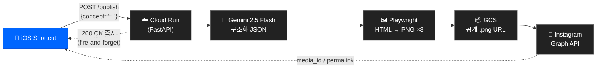

# concept-archive

> 개념 하나를 던지면, 인스타그램에 카드뉴스 8장이 자동으로 올라간다.

iOS 단축어에 "양자역학"이라고 입력하고 실행하면,
약 90초 뒤 [@what_is_this.zip](https://instagram.com/what_is_this.zip)에 8장짜리 카드뉴스 캐러셀이 올라온다.

<!-- 스크린샷 추가 예정: docs/screenshots/hero.png -->
<!--  -->

---

## TL;DR

- **입력**: 개념 키워드 한 줄 (iOS 단축어)
- **출력**: 인스타그램 피드에 8장 캐러셀 포스트
- **소요**: 응답 즉시, 실제 발행까지 ~90초
- **스택**: FastAPI + Gemini 2.5 Flash + Playwright + Cloud Run + GCS + IG Graph API

---

## 아키텍처



**흐름 한 줄**: 개념 한 줄 → 즉시 200 응답 → 뒤에서 8장 생성·렌더·업로드·발행 → 약 90초 뒤 IG 피드에 캐러셀로 등장.

자세한 단계별 데이터 흐름은 **[docs/architecture.md](docs/architecture.md)** 참고.

---

## 각 단계에서 왜 이 스택을 썼는가

| # | 단계 | 스택 | 왜 이걸 선택했는가 |
|---|---|---|---|
| 1 | **입력** | iOS Shortcut | 폰에서 키워드 한 줄만 치면 끝. 앱 개발 비용 0, UI 개발 비용 0. 개인 도구라 타겟 유저가 "나 하나". |
| 2 | **서버** | Cloud Run + FastAPI | ▸ **Cloud Run**: Playwright + Chromium이 들어간 이미지는 Lambda(250MB) · GCF 용량 제한을 넘음. 컨테이너 그대로 올릴 수 있고 요청 없으면 0-스케일이라 비용도 거의 0.<br/>▸ **FastAPI**: `async` 네이티브 → `asyncio.create_task`로 fire-and-forget이 간결. Pydantic으로 요청 스키마 강제. |
| 3 | **생성** | Gemini 2.5 Flash | ▸ **Flash**: 8장 카드 생성은 깊은 추론이 아니라 요약 + 포맷팅. 속도·단가 모두 최적 (카드 1장당 0.1센트).<br/>▸ **structured output (`response_schema`)**: 응답을 `{title, tags, cards[{id, main}]}` 스키마로 강제 → 파서·검증 코드 불필요. |
| 4 | **렌더** | Playwright (Chromium) | ▸ **Pillow로 한글 타이포 직접 계산은 불가능** (Pretendard 커닝, 자동 줄바꿈, flexbox 재현이 지옥).<br/>▸ 브라우저 렌더 엔진을 쓰면 **`index.html` 프리뷰 == 최종 PNG**가 1:1 보장됨. 디자인은 HTML/CSS만 만지면 됨. |
| 5 | **저장** | Google Cloud Storage | ▸ **IG Graph API는 바이트 업로드 불가** — `image_url`만 받고, 리다이렉트 미추적, `.png`/`.jpg` 확장자만 허용.<br/>▸ 공개 버킷 + 확장자 포함 파일명 + Content-Type 명시 = IG가 받아줌.<br/>▸ 7일 lifecycle 자동 삭제 (원본은 IG에 박히므로 임시 저장소 역할). |
| 6 | **발행** | Instagram Graph API | ▸ 유일한 공식 자동 업로드 경로 (Business 계정 전용).<br/>▸ 캐러셀은 3단계 상태 머신(컨테이너 N개 → 부모 컨테이너 → publish) — `status_code=FINISHED` 폴링까지 `instagram.py`에 격리. |

### 런타임 선택도 이유 있음

| 설정 | 값 | 이유 |
|---|---|---|
| Region | `asia-northeast3` (서울) | 호출자(한국) ↔ Cloud Run 지연 최소화 |
| Memory / CPU | 2Gi / 2 | Chromium + 8장 렌더가 1Gi 아래에서는 OOM |
| concurrency | 1 | 한 인스턴스에 Chromium 2개 띄우면 메모리 초과 |
| max-instances | 3 | 개인 용도라 동시성 ≤ 2, 비용 폭주 방어 |
| `--no-cpu-throttling` | **필수** | 응답 반환 후 CPU 스로틀링되면 백그라운드 태스크가 멈춤 |

---

## 폴더 구조

```
concept-archive/
├── index.html              # 브라우저 프리뷰 (서버 없이 디자인 확인용)
├── shared/styles.css       # 디자인 토큰 (색/타이포/스페이싱) + 공통 레이아웃
├── templates/              # 카드 15종 HTML (01-overview ~ 15-oneline)
├── backend/
│   ├── main.py             # FastAPI 엔드포인트 + fire-and-forget 디스패처
│   ├── prompts.py          # 카드 15종 메타 + 시스템 프롬프트 + 응답 스키마
│   ├── gemini_client.py    # Gemini API 얇은 래퍼
│   ├── renderer.py         # 카드 JSON → 1080×1350 PNG (Playwright)
│   ├── storage.py          # PNG → GCS 공개 URL
│   ├── instagram.py        # IG Graph API 캐러셀 3단계 발행
│   ├── requirements.txt
│   └── .env.example
├── docs/
│   ├── architecture.md     # 파이프라인 상세 흐름
│   ├── decisions.md        # 설계 결정 기록
│   ├── design.md           # 카드 디자인 시스템 명세
│   └── screenshots/        # README/문서용 이미지
├── Dockerfile              # playwright/python + Noto CJK
└── README.md
```

---

## 설계 결정 요약

풀 버전은 **[docs/decisions.md](docs/decisions.md)**. 핵심만:

1. **Cloud Run (서버리스 컨테이너)** — VM은 비싸고 Lambda는 이미지 용량 제한(Playwright 못 올림). Cloud Run이 유일한 답.
2. **Fire-and-forget 패턴** — iOS 단축어 타임아웃 60초, 실제 파이프라인 90초. 동기 응답 불가능 → `asyncio.create_task` + 즉시 200.
3. **`--no-cpu-throttling` 필수** — 응답 후 CPU 스로틀링되면 백그라운드 태스크가 죽음. Cloud Run 기본값에선 동작 안 함.
4. **Playwright로 HTML→PNG** — Pillow로 한글 타이포 수동 계산은 지옥. 브라우저 렌더 == 최종 결과 1:1 보장.
5. **GCS 경유 (IG 바이트 업로드 불가)** — IG Graph API는 `image_url`만 받고, 리다이렉트 안 따라가고, `.png`/`.jpg` 확장자만 허용.
6. **Gemini 2.5 Flash + structured output** — 카드뉴스는 요약 작업. Flash로 충분. `response_schema`로 JSON 강제.
7. **concurrency=1 / max-instances=3** — Chromium 동시 기동은 OOM. 인스턴스당 1개만, 최대 3인스턴스.

---

## 로컬 개발

```bash
# 프론트엔드 프리뷰만
python3 -m http.server 8000   # → http://localhost:8000/index.html

# 백엔드
cd backend
python3.13 -m venv .venv && source .venv/bin/activate
pip install -r requirements.txt
playwright install chromium

cp .env.example .env          # 키 채우기
export $(grep -v '^#' .env | xargs)
uvicorn main:app --reload --port 8080
```

> **Python 3.13 필요** — `str | None` union syntax 사용.

---

## 배포 (Google Cloud Run)

### 1. GCP 리소스 준비
- 프로젝트 생성 후 다음 API 활성화: `run.googleapis.com`, `secretmanager.googleapis.com`, `storage.googleapis.com`, `cloudbuild.googleapis.com`
- GCS 버킷 하나 생성 (public read + 7-day lifecycle delete 권장)
- Secret Manager에 4개 시크릿: `gemini-key`, `ig-token`, `ig-user-id`, `api-secret`
- Cloud Run 기본 서비스 계정에 `secretmanager.secretAccessor` + 버킷 `storage.objectAdmin` 부여

### 2. 배포

```bash
gcloud run deploy card-news \
  --source . \
  --region asia-northeast3 \
  --memory 2Gi --cpu 2 \
  --timeout 300 \
  --max-instances 3 --concurrency 1 \
  --no-cpu-throttling \
  --set-secrets GEMINI_KEY=gemini-key:latest,IG_TOKEN=ig-token:latest,IG_USER_ID=ig-user-id:latest,API_SECRET=api-secret:latest \
  --set-env-vars GCS_BUCKET=your-bucket-name \
  --allow-unauthenticated
```

### 3. iOS 단축어 설정
2개 액션:
1. **URL 콘텐츠 가져오기**
   - URL: `https://<YOUR_CLOUD_RUN_URL>/publish`
   - 방식: POST
   - 헤더: `Authorization: Bearer <API_SECRET>`, `Content-Type: application/json`
   - 본문(JSON): `{"concept": "매번 묻기"}`
2. **알림 보기** — 본문은 위 액션의 응답(URL 콘텐츠) 변수

---

## API

모든 엔드포인트: `Authorization: Bearer <API_SECRET>`

### `POST /publish`
개념 → 전체 파이프라인 (fire-and-forget). 즉시 200 반환, 실제 발행은 백그라운드.

```json
{"concept": "양자역학"}
```
응답:
```json
{"ok": true, "queued": true, "concept": "양자역학"}
```

### `POST /generate`
개념 → 카드 JSON (IG 발행 X, 디버깅/수동 미리보기용).

```json
{"concept": "양자역학"}
```
응답:
```json
{"title": "...", "tags": ["#...", "..."], "cards": [{"id": "01-overview", "main": "<html>..."}, ...]}
```

---

## 보안

- 모든 시크릿은 Secret Manager. 로컬 `.env`는 `.gitignore` 처리됨.
- IG long-lived 토큰은 60일마다 만료 → Secret Manager 값 교체 후 재배포.
- 호출자 인증은 Bearer 공유 시크릿 1개 (개인용 툴이라 충분).

---

## 디자인 시스템

카드 15종의 고정 위치 / 타이포 스케일 / 컬러 토큰 / 레이아웃 규칙은 **[docs/design.md](docs/design.md)**.

- Canvas: 1080×1350 (IG 4:5)
- 한글: Pretendard / 영문·숫자: Inter (CDN)
- 컬러: 무채색 5단계 + 포인트 컬러 1개 (`--accent`만 바꾸면 전체 테마 변경)

---

## 라이선스

개인 프로젝트. 코드는 자유롭게 참고·포크 가능. 생성되는 카드뉴스의 저작권과 IG 계정은 작성자에게 있음.
