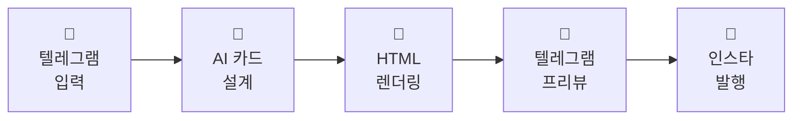

# concept-archive

> **모르는 개념을 던지면, 이해하기 쉬운 카드뉴스 8장으로 돌려받고 — 인스타그램에 아카이브한다.**

<p align="left">
  
  
  
  
  
  
  
  
</p>

모르는 개념이 생길 때마다 텔레그램 봇에 *"더닝-크루거 효과"* 처럼 한 줄을 보내면, 약 60초 뒤 봇이 **나만의 과외 노트 같은 카드뉴스 8장**을 앨범으로 답장합니다. 이해가 됐다 싶으면 `📤 인스타 아카이브` 버튼을 눌러 [@what_is_this.zip](https://instagram.com/what_is_this.zip)에 남겨둡니다 — 나중에 다시 꺼내 볼 수 있게.

---

## 어떻게 동작하나요?

#### 한 줄 요약



#### 단계별 상세

| # | 단계 | 도구 | 결과물 |
|:---:|---|---|---|
| 1 | **수신** | Telegram Bot Webhook | 사용자가 보낸 개념 한 줄 |
| 2 | **설계** | Gemini 3 Flash | 14개 템플릿 중 8장 조합 + 카드별 카피 JSON |
| 3 | **렌더** | Playwright Chromium | 1080×1350 PNG × 8장 |
| 4 | **저장** | Google Cloud Storage | IG가 받을 수 있는 공개 URL |
| 5 | **프리뷰** | Telegram `sendMediaGroup` | 채팅창에 카드 앨범 + `🔁 다시 / 📤 아카이브` 버튼 |
| 6 | **발행** | Instagram Graph API | 사용자 승인 시 캐러셀 게시물로 등록 |

> 텔레그램에서 먼저 검토하고 마음에 들 때만 인스타에 발행하는 **2단계 구조**입니다.

---

## 결과물 예시

개념마다 어울리는 템플릿 14종 중에서 LLM이 8장을 골라 조합합니다. (01·개요, 15·한줄요약은 고정)

| | | |
|:-:|:-:|:-:|
|  |  |  |
| **01 · 개요** (고정) | **02 · 비유** | **03 · 단계** |

<details>
<summary><b>나머지 11종 펼치기 (04–15)</b></summary>

<br>

| | | |
|:-:|:-:|:-:|
|  |  |  |
| **04 · 매트릭스** | **05 · 공식** | **06 · 인과 체인** |
|  |  |  |
| **07 · 비교** | **08 · 장단점** | **09 · 스펙트럼** |
|  |  |  |
| **10 · 타임라인** | **11 · 실생활 사례** | **13 · FAQ** |
|  |  | |
| **14 · 체크리스트** | **15 · 한줄요약** (고정) | |

</details>

---

## 기술 스택 (개발자용)

| 영역 | 도구 |
|---|---|
| 언어 | Python 3.13 |
| 백엔드 | FastAPI + asyncio |
| AI | Google Gemini 3 Flash — `response_schema` 구조화 출력 |
| 렌더링 | Playwright (Chromium) — HTML/CSS 템플릿을 PNG로 |
| 저장 | Google Cloud Storage (public, 7일 TTL) |
| 메신저 | Telegram Bot API |
| 발행 | Instagram Graph API v21.0 |
| 인프라 | Cloud Run + Secret Manager |
| 개발 도구 | Claude Code |

### 설계 포인트
- **Fire-and-forget Webhook**: 파이프라인 60~120초 → 텔레그램 webhook 타임아웃 회피 위해 `200 OK` 즉시 응답 후 백그라운드 실행 (`--no-cpu-throttling` 필수)
- **HTML→PNG 단일 진실 소스**: 디자인을 CSS로 수정하면 브라우저 프리뷰와 서버 렌더 결과가 1:1로 일치 — 동일 HTML을 LLM 프롬프트에도 그대로 주입
- **사람 검토 단계**: 텔레그램 인라인 키보드(`🔁 다시 / 📤 아카이브`)로 LLM 결과를 사람이 한 번 거르도록 설계

---

## 직접 돌려보고 싶다면

<details>
<summary>로컬 실행 (펼치기)</summary>

### 1. 의존성 설치
```bash
cd backend
python3.13 -m venv .venv && source .venv/bin/activate
pip install -r requirements.txt
playwright install chromium
```

### 2. 환경 변수 설정
```bash
cp .env.example .env
# .env에 아래 값 입력
```

| 변수 | 설명 |
|---|---|
| `GEMINI_KEY` | Google AI Studio 발급 키 |
| `IG_TOKEN` / `IG_USER_ID` | Instagram Graph API 장기 토큰 + Business 계정 ID |
| `TG_TOKEN` | BotFather에서 받은 텔레그램 봇 토큰 |
| `API_SECRET` | webhook 서명 검증용 임의 문자열 |
| `GCS_BUCKET` | 카드 이미지를 올릴 GCS 버킷 (public read) |

### 3. 실행
```bash
export $(grep -v '^#' .env | xargs)
uvicorn main:app --reload --port 8080
```

</details>

<details>
<summary>Cloud Run 배포 + 텔레그램 봇 연결 (펼치기)</summary>

Secret Manager에 `gemini-key`, `ig-token`, `ig-user-id`, `api-secret`, `tg-token` 등록 후:

```bash
gcloud run deploy card-news \
  --source . --region asia-northeast3 \
  --memory 2Gi --cpu 2 --max-instances 3 --concurrency 1 \
  --no-cpu-throttling \
  --set-secrets GEMINI_KEY=gemini-key:latest,IG_TOKEN=ig-token:latest,IG_USER_ID=ig-user-id:latest,API_SECRET=api-secret:latest,TG_TOKEN=tg-token:latest \
  --set-env-vars GCS_BUCKET=your-bucket-name \
  --allow-unauthenticated
```

텔레그램 webhook 등록:
```bash
curl -X POST "https://api.telegram.org/bot<TG_TOKEN>/setWebhook" \
  -d "url=https://<CLOUD_RUN_URL>/tg" \
  -d "secret_token=<API_SECRET>"
```

</details>

---

## 파일 구조

```
concept-archive/
├── index.html                # 브라우저 프리뷰 (디자인 확인용)
├── shared/styles.css         # 디자인 토큰 + 공통 레이아웃
├── templates/                # 카드 14종 HTML
├── backend/
│   ├── main.py               # FastAPI + /tg 웹훅 + 백그라운드 태스크
│   ├── telegram.py           # Telegram Bot API 래퍼
│   ├── prompts.py            # 시스템 프롬프트 + 응답 스키마
│   ├── gemini_client.py      # Gemini 구조화 출력 호출
│   ├── renderer.py           # Playwright HTML→PNG
│   ├── storage.py            # GCS 업로드
│   └── instagram.py          # IG Graph API 캐러셀 발행
├── docs/                     # architecture · decisions · design
└── Dockerfile
```
