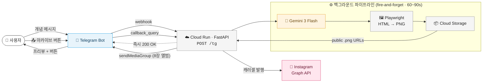
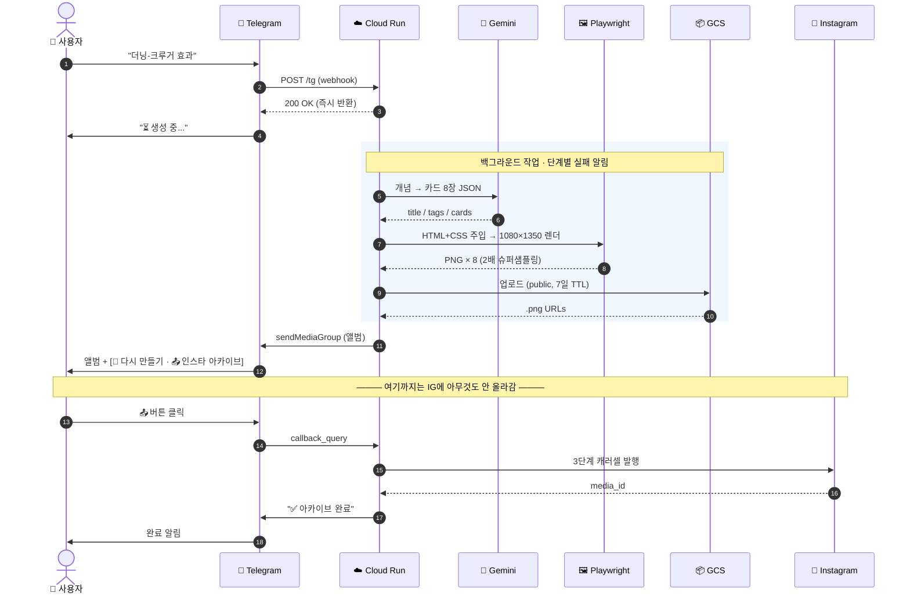

# concept-archive

> 개념 하나를 던지면, 인스타그램에 카드뉴스 8장이 올라간다.

<p align="center">
  
  
  
  
  
  
  
  
</p>

텔레그램 봇에 "양자역학"이라고 보내면, 약 90초 뒤 봇이 8장짜리 카드뉴스를
앨범으로 답장한다. 마음에 들면 **📤 인스타 아카이브** 버튼을 눌러
[@what_is_this.zip](https://instagram.com/what_is_this.zip)에 캐러셀로 발행.

---

## 🖼 템플릿 예시

"더닝-크루거 효과"라는 개념으로 실제 생성된 카드뉴스. 01~03번을 먼저 보여주고, 04~15번은 펼치기 안에 있음. 디자인 규격은 **[docs/design.md](docs/design.md)** 참고.

| | | |
|:-:|:-:|:-:|
|  |  |  |
| **01 · 개요** (표지 고정) | **02 · 비유** | **03 · 단계** |

<details>
<summary><b>📇 나머지 12종 펼치기 (04~15)</b></summary>

<br>

| | | |
|:-:|:-:|:-:|
|  |  |  |
| **04 · 매트릭스** | **05 · 공식** | **06 · 인과 체인** |
|  |  |  |
| **07 · 비교** | **08 · 장단점** | **09 · 스펙트럼** |
|  |  |  |
| **10 · 타임라인** | **11 · 실생활 사례** | **12 · 오해와 진실** |
|  |  |  |
| **13 · FAQ** | **14 · 체크리스트** | **15 · 한줄요약** (마지막 고정) |

</details>

---

## 🔄 파이프라인

### 큰 그림



### 시간 순서



### 핵심 설계

| 결정 | 이유 |
|---|---|
| **프리뷰 먼저, 발행은 선택** | 카드가 먼저 텔레그램에 답장으로 오고 `📤` 버튼을 눌러야만 IG에 발행됨. 실패작 자동 발행 방지. |
| **Fire-and-forget** | `/tg`는 `asyncio.create_task`로 파이프라인을 띄우고 즉시 200을 반환 → 텔레그램 웹훅 타임아웃 회피. Cloud Run에 `--no-cpu-throttling` 필수. |
| **단계별 에러 태그** | `Gemini 생성` / `카드 렌더링` / `GCS 업로드` / `텔레그램 전송` 4단계 각각 try 블록 → 실패 시 어느 단계가 죽었는지 바로 챗으로 통지. |
| **Chromium 실제 렌더** | 브라우저에서 보던 HTML 템플릿 = IG에 올라가는 결과. 2x 슈퍼샘플링으로 텍스트 선명도 확보. |
| **GCS 경유 발행** | IG Graph API는 `.png`/`.jpg`로 끝나고 리다이렉트 없는 공개 URL만 받음 (picsum 류는 `9004` 에러). GCS로 `.png` 확장자 고정 + public read. |
| **`_LAST_JOBS` 인메모리 캐시** | `redo`/`archive` 버튼이 재호출할 수 있도록 chat_id → 마지막 결과 캐싱. 콜드 스타트 시 날아가지만 그땐 사용자가 다시 보내면 됨. |

---

## 🧱 기술 스택

파이프라인 단계별로 어떤 기술이 어디에 쓰이는지.

### 🖥 클라이언트 — 개념 입력
- **Telegram Bot API** — BotFather로 만든 개인 봇. 메시지 수신 + 앨범 전송 + 인라인 버튼
- 별도 래퍼 없이 [`backend/telegram.py`](backend/telegram.py)에서 `httpx`로 직접 호출

### ☁️ 백엔드 — 웹훅 처리 & 오케스트레이션
- **FastAPI 0.115** + **Uvicorn 0.32** + **Pydantic 2.9** — `/tg` 웹훅, `asyncio.create_task` 기반 fire-and-forget
- **Python 3.13** — 최신 타입 문법(`str | None`) 필요
- 외부 호출은 전부 **`httpx`** 비동기 클라이언트

### 🧠 생성 — 개념 → 카드 JSON
- **Google Gemini 3 Flash** (`google-genai` SDK)
- `response_schema`로 `{title, tags, cards[{id, main}]}` 스키마 강제 → 파서 불필요

### 🎨 렌더링 — JSON → PNG 8장
- **Playwright 1.48 (Chromium)** — 1080×1350, 2x 슈퍼샘플링
- **HTML5 + CSS3** · 카드 15종은 [`templates/01~15.html`](templates/) 순수 HTML
- **Pretendard** · **Inter** 웹폰트 (CDN)

### 📦 저장 & 발행
- **Google Cloud Storage** — public `.png`, 7일 TTL 자동 삭제 lifecycle
- **Instagram Graph API v21.0** — 3단계 캐러셀 (child 컨테이너 → CAROUSEL → publish)

### 🚀 인프라 & 배포
- **Google Cloud Run** — `asia-northeast3`, 2Gi / 2CPU, `concurrency=1`, `--no-cpu-throttling` 필수
- **Cloud Build** — `gcloud run deploy --source .` 한 방 배포
- **Secret Manager** — 5개 시크릿(`gemini-key` · `ig-token` · `ig-user-id` · `api-secret` · `tg-token`)
- **Docker** — 베이스 `mcr.microsoft.com/playwright/python:v1.48.0-jammy` (+ Noto CJK 폰트)

---

## 📁 폴더 구조

```
concept-archive/
├── index.html              # 브라우저 프리뷰 (디자인 확인용)
├── shared/styles.css       # 디자인 토큰 + 공통 레이아웃
├── templates/              # 카드 15종 HTML (01-overview ~ 15-oneline)
├── backend/
│   ├── main.py             # FastAPI + fire-and-forget 디스패처 + /tg 웹훅
│   ├── telegram.py         # Telegram Bot API 얇은 래퍼 (httpx 기반)
│   ├── prompts.py          # 카드 메타 + 시스템 프롬프트 + 응답 스키마
│   ├── gemini_client.py    # Gemini API 래퍼
│   ├── renderer.py         # Playwright HTML→PNG
│   ├── storage.py          # GCS 업로드
│   └── instagram.py        # IG Graph API 캐러셀 발행
├── docs/
│   ├── pipeline.md         # 파이프라인 상세
│   ├── decisions.md        # 설계 결정 기록
│   └── design.md           # 카드 디자인 시스템
└── Dockerfile
```

---

## 🚀 시작하기

### 로컬

```bash
cd backend
python3.13 -m venv .venv && source .venv/bin/activate
pip install -r requirements.txt
playwright install chromium

cp .env.example .env          # 키 채우기
export $(grep -v '^#' .env | xargs)
uvicorn main:app --reload --port 8080
```

### 배포 (Cloud Run)

Secret Manager에 `gemini-key`, `ig-token`, `ig-user-id`, `api-secret`, `tg-token` 5개를 넣고:

```bash
gcloud run deploy card-news \
  --source . --region asia-northeast3 \
  --memory 2Gi --cpu 2 \
  --max-instances 3 --concurrency 1 \
  --no-cpu-throttling \
  --set-secrets GEMINI_KEY=gemini-key:latest,IG_TOKEN=ig-token:latest,IG_USER_ID=ig-user-id:latest,API_SECRET=api-secret:latest,TG_TOKEN=tg-token:latest \
  --set-env-vars GCS_BUCKET=your-bucket-name \
  --allow-unauthenticated
```

### 텔레그램 봇 연결

1. [@BotFather](https://t.me/BotFather)에서 `/newbot` → 봇 이름·username 정하고 **봇 토큰** 받기 → Secret Manager의 `tg-token`에 저장
2. Cloud Run 배포 완료 후, 봇 웹훅을 `/tg` 엔드포인트로 등록:
   ```bash
   curl -X POST "https://api.telegram.org/bot<TG_TOKEN>/setWebhook" \
     -d "url=https://<CLOUD_RUN_URL>/tg" \
     -d "secret_token=<API_SECRET>"
   ```
   (`secret_token`은 `API_SECRET`과 동일한 값을 사용 — 봇이 보내는 `X-Telegram-Bot-Api-Secret-Token` 헤더로 검증)
3. 봇과 대화 시작 → 개념 메시지 보내기 → 1~2분 후 카드뉴스 앨범 도착 → `📤 인스타 아카이브` 버튼으로 발행
