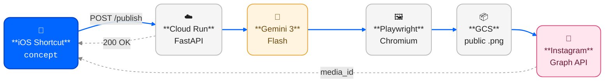

# concept-archive

> 개념 하나를 던지면, 인스타그램에 카드뉴스 8장이 자동으로 올라간다.

iOS 단축어에 "양자역학"이라고 입력하면, 약 90초 뒤
[@what_is_this.zip](https://instagram.com/what_is_this.zip) 피드에 8장짜리 캐러셀이 올라온다.

---

## 템플릿 예시

"더닝-크루거 효과"라는 개념으로 실제 생성된 카드뉴스. 01~03번을 먼저 보여주고, 04~15번은 펼치기 안에 있음. 디자인 규격은 **[docs/design.md](docs/design.md)** 참고.

| | | |
|:-:|:-:|:-:|
|  |  |  |
| **01 · 개요** (표지 고정) | **02 · 비유** | **03 · 단계** |

<details>
<summary><b>📇 나머지 12종 펼치기 (04~15)</b></summary>

<br>

| | | |
|:-:|:-:|:-:|
|  |  |  |
| **04 · 매트릭스** | **05 · 공식** | **06 · 인과 체인** |
|  |  |  |
| **07 · 비교** | **08 · 장단점** | **09 · 스펙트럼** |
|  |  |  |
| **10 · 타임라인** | **11 · 실생활 사례** | **12 · 오해와 진실** |
|  |  |  |
| **13 · FAQ** | **14 · 체크리스트** | **15 · 한줄요약** (마지막 고정) |

</details>

---

## 파이프라인



개념 한 줄 → 즉시 200 응답 → 뒤에서 8장 생성·렌더·업로드·발행 → 약 90초 뒤 IG 피드에 캐러셀로 등장.

---

## 각 단계에서 왜 이 스택을 썼는가

| 단계 | 스택 | 왜 |
|---|---|---|
| **입력** | iOS Shortcut | 폰에서 키워드 한 줄로 트리거. 앱·UI 개발 비용 0. |
| **서버** | Cloud Run + FastAPI | Playwright+Chromium 이미지는 Lambda 용량 제한을 넘음 → Cloud Run이 유일한 선택지. FastAPI의 `async`로 fire-and-forget 패턴이 간결해짐. |
| **생성** | Gemini 3 Flash | 8장 카드는 요약+포맷팅 작업이라 Flash로 충분. `response_schema`로 JSON 강제 → 파서 불필요. |
| **렌더** | Playwright (Chromium) | 한글 타이포(Pretendard, 커닝, flexbox)를 Pillow로 재현 불가. 브라우저 렌더 == 최종 PNG 1:1 보장. |
| **저장** | Google Cloud Storage | IG는 바이트 업로드 불가, `image_url`만 받음. 공개 버킷 + 확장자 + Content-Type 맞춰야 받아줌. |
| **발행** | Instagram Graph API | Business 계정 유일한 공식 경로. 캐러셀은 3단계 상태 머신(컨테이너→부모→publish). |

더 깊은 설계 근거는 **[docs/decisions.md](docs/decisions.md)**, 단계별 상세 흐름은 **[docs/pipeline.md](docs/pipeline.md)**.

---

## 기술 스택

| 레이어 | 사용 기술 |
|---|---|
| **런타임** | Python 3.13 · Docker (`mcr.microsoft.com/playwright/python:v1.48.0-jammy`) |
| **백엔드** | FastAPI 0.115 · Uvicorn 0.32 · Pydantic 2.9 · httpx 0.27 |
| **LLM** | Google Gemini 3 Flash (`google-genai` SDK) · structured output |
| **렌더링** | Playwright 1.48 (Chromium) · HTML5 · CSS3 |
| **프론트 (프리뷰)** | Vanilla JS · Pretendard · Inter (CDN) |
| **인프라** | Google Cloud Run · Cloud Storage · Secret Manager · Cloud Build |
| **외부 API** | Instagram Graph API v21.0 (Business 계정) |
| **클라이언트** | iOS Shortcuts |
| **CI / 배포** | `gcloud run deploy --source .` (Cloud Build 자동) |

---

## 폴더 구조

```
concept-archive/
├── index.html              # 브라우저 프리뷰 (디자인 확인용)
├── shared/styles.css       # 디자인 토큰 + 공통 레이아웃
├── templates/              # 카드 15종 HTML (01-overview ~ 15-oneline)
├── backend/
│   ├── main.py             # FastAPI + fire-and-forget 디스패처
│   ├── prompts.py          # 카드 메타 + 시스템 프롬프트 + 응답 스키마
│   ├── gemini_client.py    # Gemini API 래퍼
│   ├── renderer.py         # Playwright HTML→PNG
│   ├── storage.py          # GCS 업로드
│   └── instagram.py        # IG Graph API 캐러셀 발행
├── docs/
│   ├── pipeline.md         # 파이프라인 상세
│   ├── decisions.md        # 설계 결정 기록
│   └── design.md           # 카드 디자인 시스템
└── Dockerfile
```

---

## 시작하기

### 로컬

```bash
cd backend
python3.13 -m venv .venv && source .venv/bin/activate
pip install -r requirements.txt
playwright install chromium

cp .env.example .env          # 키 채우기
export $(grep -v '^#' .env | xargs)
uvicorn main:app --reload --port 8080
```

### 배포 (Cloud Run)

Secret Manager에 `gemini-key`, `ig-token`, `ig-user-id`, `api-secret` 4개를 넣고:

```bash
gcloud run deploy card-news \
  --source . --region asia-northeast3 \
  --memory 2Gi --cpu 2 \
  --max-instances 3 --concurrency 1 \
  --no-cpu-throttling \
  --set-secrets GEMINI_KEY=gemini-key:latest,IG_TOKEN=ig-token:latest,IG_USER_ID=ig-user-id:latest,API_SECRET=api-secret:latest \
  --set-env-vars GCS_BUCKET=your-bucket-name \
  --allow-unauthenticated
```

### iOS 단축어

1. **URL 콘텐츠 가져오기**: POST `https://<CLOUD_RUN_URL>/publish`, 헤더 `Authorization: Bearer <API_SECRET>`, 본문 `{"concept": "매번 묻기"}`
2. **알림 보기** — 응답 변수 표시
