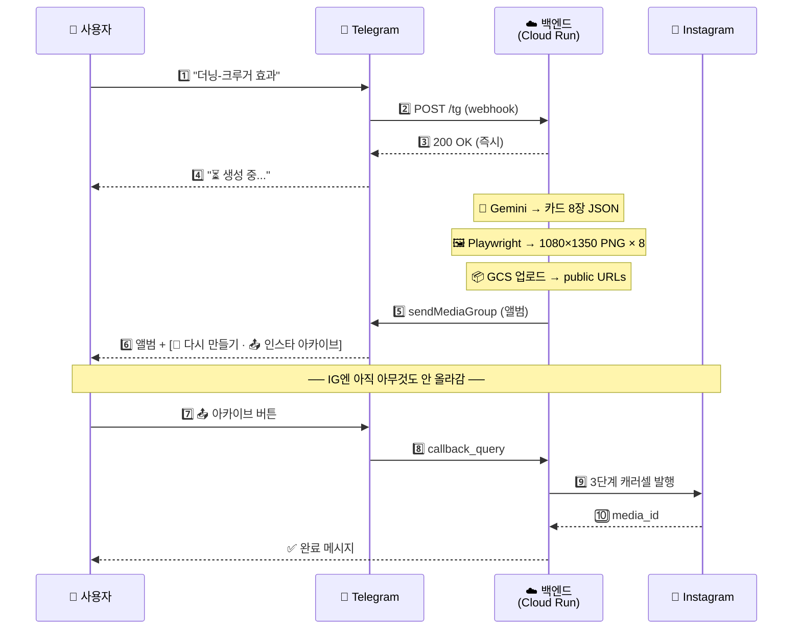

# concept-archive

> 모르는 개념을 던지면, 이해하기 쉬운 카드뉴스 8장으로 돌려받고 — 인스타그램에 아카이브한다.

<p align="center">
  
  
  
  
  
  
  
  
</p>

모르는 개념이 생길 때마다 텔레그램 봇에 "더닝-크루거 효과"처럼 한 줄 보내면,
약 90초 뒤 봇이 **나만의 과외 노트 같은 카드뉴스 8장**을 앨범으로 답장한다.
이해가 됐다 싶으면 **📤 인스타 아카이브** 버튼을 눌러
[@what_is_this.zip](https://instagram.com/what_is_this.zip)에 남겨둠 — 나중에 다시 꺼내 볼 수 있게.

---

## 🖼 템플릿 예시

"더닝-크루거 효과"를 봇에 보냈을 때 실제로 받아본 카드 8장. 봇은 개념마다 어울리는 템플릿을 **14종 중에서 골라** 조합하고, **01 · 개요**(표지)와 **15 · 한줄요약**(마지막)은 고정이다. 아래는 01–03번만 먼저 보여주고, 나머지 11종(04–15)은 펼치기 안에 있음. 디자인 규격은 **[docs/design.md](docs/design.md)** 참고.

| | | |
|:-:|:-:|:-:|
|  |  |  |
| **01 · 개요** (표지 고정) | **02 · 비유** | **03 · 단계** |

<details>
<summary><b>📇 나머지 11종 펼치기 (04–15)</b></summary>

<br>

| | | |
|:-:|:-:|:-:|
|  |  |  |
| **04 · 매트릭스** | **05 · 공식** | **06 · 인과 체인** |
|  |  |  |
| **07 · 비교** | **08 · 장단점** | **09 · 스펙트럼** |
|  |  |  |
| **10 · 타임라인** | **11 · 실생활 사례** | **13 · FAQ** |
|  |  | |
| **14 · 체크리스트** | **15 · 한줄요약** (마지막 고정) | |

</details>

---

## 🔄 파이프라인

### 큰 그림

```mermaid
flowchart LR
    A("👤 개념")
    B("📨 Telegram")
    C("☁️ Cloud Run")
    D("🧠 Gemini")
    E("🖼 Playwright")
    F("📦 GCS")
    G("📥 프리뷰")
    H("📸 Instagram")

    A --> B --> C --> D --> E --> F --> G
    G -. "📤" .-> H

    classDef user fill:#1f1f1f,stroke:#555,color:#fff
    classDef tg fill:#26A5E4,stroke:#1d8bc0,color:#fff
    classDef gcp fill:#4285F4,stroke:#1a56c2,color:#fff
    classDef ai fill:#8E75B2,stroke:#6b5689,color:#fff
    classDef pw fill:#2EAD33,stroke:#1f7a22,color:#fff
    classDef gcs fill:#F9AB00,stroke:#c28700,color:#1a1a1a
    classDef out fill:#2a2a2a,stroke:#888,color:#fff,stroke-dasharray:4 2
    classDef ig fill:#E4405F,stroke:#b0304a,color:#fff

    class A user
    class B tg
    class C gcp
    class D ai
    class E pw
    class F gcs
    class G out
    class H ig
```



> 실선 = 자동 실행 · 점선 = 사용자가 `📤` 버튼 눌러야 발동

### 시간 순서



---

## 🧱 기술 스택

파이프라인 단계별로 어떤 기술이 어디에 쓰이는지.

### 🖥 클라이언트 — 개념 입력
- **Telegram Bot API** — BotFather로 만든 개인 봇. 메시지 수신 + 앨범 전송 + 인라인 버튼
- 별도 래퍼 없이 [`backend/telegram.py`](backend/telegram.py)에서 `httpx`로 직접 호출

### ☁️ 백엔드 — 웹훅 처리 & 오케스트레이션
- **FastAPI 0.115** + **Uvicorn 0.32** + **Pydantic 2.9** — `/tg` 웹훅, `asyncio.create_task` 기반 fire-and-forget
- **Python 3.13** — 최신 타입 문법(`str | None`) 필요
- 외부 호출은 전부 **`httpx`** 비동기 클라이언트

### 🧠 생성 — 개념 → 카드 JSON
- **Google Gemini 3 Flash** (`google-genai` SDK)
- `response_schema`로 `{title, tags, cards[{id, main}]}` 스키마 강제 → 파서 불필요

### 🎨 렌더링 — JSON → PNG 8장
- **Playwright 1.48 (Chromium)** — 1080×1350, 2x 슈퍼샘플링
- **HTML5 + CSS3** · 카드 14종은 [`templates/01–15.html`](templates/) 순수 HTML
- **Pretendard** · **Inter** 웹폰트 (CDN)

### 📦 저장 & 발행
- **Google Cloud Storage** — public `.png`, 7일 TTL 자동 삭제 lifecycle
- **Instagram Graph API v21.0** — 3단계 캐러셀 (child 컨테이너 → CAROUSEL → publish)

### 🚀 인프라 & 배포
- **Google Cloud Run** — `asia-northeast3`, 2Gi / 2CPU, `concurrency=1`, `--no-cpu-throttling` 필수
- **Cloud Build** — `gcloud run deploy --source .` 한 방 배포
- **Secret Manager** — 5개 시크릿(`gemini-key` · `ig-token` · `ig-user-id` · `api-secret` · `tg-token`)
- **Docker** — 베이스 `mcr.microsoft.com/playwright/python:v1.48.0-jammy` (+ Noto CJK 폰트)

---

## 🧠 Gemini 시스템 프롬프트 (한글 번역)

실제 [`backend/prompts.py`](backend/prompts.py)에서 Gemini 3 Flash로 넘기는 시스템 프롬프트 전문을 한글로 옮긴 것이다. (원문은 영어 + 한국어 예시 혼용.)

~~~
당신은 카드뉴스 디자이너입니다. 개념 하나가 주어지면, 정해진 서사 순서에 따라 정확히 8장의 카드를 만듭니다. 각 서사 단계마다 아래 14개 템플릿 중 하나를 골라, 개념에 맞는 내용으로 채워서 일관된 인스타그램 캐러셀을 구성합니다.

# 출력 형식
엄격한 raw JSON만 출력하세요 (마크다운 펜스 금지, 해설 금지). 모양은 다음과 같습니다:
```
{
  "title": "<개념 이름, 한국어>",
  "tags": ["#분야태그"],
  "cards": [
    { "id": "01", "main": "<.main 내부 HTML>" },
    ...
  ]
}
```

# 태그
- 해당 개념과 내용에 가장 잘 맞는 한국어 해시태그를 1–2개 생성하세요. 미리 정해진 목록에서 고르지 말고, 개념 자체에서 가장 정확한 분야/주제 태그를 추론하세요. 한국 독자가 이 콘텐츠를 실제로 찾을 때 쓸 법한, 이미 통용되고 검색 가능한 태그를 선호하세요.
- 각 태그는 "#"으로 시작하고 공백을 포함하지 않아야 합니다.

# 서사 흐름 (8단계, 카드 8장, 순서 엄격)
단계별로 정확히 카드 한 장씩, 이 순서대로 출력하세요:
1. 개요 (Intro)       → 템플릿 01                     [고정]
2. 비유 (Grasp)       → 템플릿 02                     [고정]
3. 원리 (Mechanism)   → 템플릿 03, 04, 05, 06 중 택1
4. 대조 (Contrast)    → 템플릿 07, 08, 09 중 택1
5. 사례 (Validate)    → 템플릿 10, 11 중 택1
6. 질문 (Clarify)     → 템플릿 13                     [고정]
7. 적용 (Apply)       → 템플릿 14                     [고정]
8. 마무리 (Close)     → 템플릿 15                     [고정]

# 선택 가이드 (3–7단계)
- 3단계 — 하나만 고르세요. 네 템플릿 모두 "이 개념의 내부 논리 / 구조는 무엇인가?"에 답하지만, 모양이 다릅니다:
  - 03 (단계): 한 주체가 정해진 상태를 거치는 **진행**. "다음은 무엇인가?"에 답함. 같은 주체/인물/개념이 상태 1 → 2 → 3으로 이동. 항목 간 인과 표현 금지; 흐름은 시간적/발달적. 정확히 하나의 항목을 class="item active"로 표시 (현재/핵심 단계). 예시 개념: 애도의 5단계, 더닝-크루거 4단계, 습관 형성 단계.
  - 04 (2×2 매트릭스): **2D 유형론** — 개념의 구조 자체가 두 개의 직교 이분축으로 이뤄진 좌표공간이어서 4가지 유형이 생기는 경우. 두 축이 이미 개념의 공식 정의에 포함되어 있을 때만 사용 (격자를 채우려고 지어내지 말 것). 한 사분면에 class="quadrant qN highlight"를 표시. 예시 개념: MBTI (외향/내향 × 사고/감정), 아이젠하워 (중요 × 긴급), Johari Window (내가 앎 × 타인 앎), SWOT. 개념 자체에서 두 축을 한 구절로 명명할 수 없다면 다른 템플릿을 선택하세요.
  - 05 (공식): **구조적 동일성** — 개념이 짧은 등식으로 환원됨 (A = B / C, A = B × C 등). 은유적이 아니라 진짜 정의상의 공식일 때만 사용. 예시: 자신감 = 배운 것 / 모르는 것, 복리 = 원금 × (1+이자율)^n.
  - 06 (인과사슬): 서로 다른 요소 간의 **인과**. "왜 이런 일이 일어나는가?"에 답함. A가 B를 일으키고, B가 C를 일으킴. 각 .arrow에는 명시적 인과어(때문에 / 그래서 / 결국 / 따라서 / 하여)가 반드시 들어가야 함 — 화살표가 단순히 "그다음"을 뜻한다면 03을 쓰세요. 마지막 링크는 class="link outcome". 예시 개념: 깨진 유리창 이론, 학습된 무기력, 가스라이팅 악순환.
  - 결정 테스트: 같은 주체의 선형 순서 → 03. 명명된 이분축 두 개 → 04. 한 줄 대수적 동일성 → 05. "A 때문에 B, B 때문에 C" → 06.
- 4단계 — "이 개념은 어디에 위치하는가 / 어떻게 나뉘는가?":
  - 07 (비교): 두 구체적 대상/입장을 공통 기준으로 맞대어 비교.
  - 08 (빛과 그림자): 개념 자체가 이원성으로 쪼개지는 경우 — 밝은 면 vs 어두운 면. 개념의 가장 자연스러운 단면이 "두 얼굴"일 때 사용. 개념이 명시적으로 실행 가능(습관, 방법, 결정)일 때만 얻는 것/잃는 것 문자 그대로의 구도로 바꾸세요.
  - 09 (스펙트럼): 두 극단 사이의 단일 연속체.
- 5단계:
  - 10 (타임라인): 역사적 / 연대기적 순서 — 개념이 어떻게 발견되거나 진화했는지.
  - 11 (실사례): 개념을 구체화하는 일상적 장면.
- 7단계 (적용): 템플릿 14 (체크리스트) 고정. 유연하게 해석:
  - **행동형** — 개념이 실행 가능한 경우(습관, 방법, 결정) 오늘 독자가 시도할 만한 구체적 행동 4–6개.
  - **자가진단형** — 개념이 기술적 성격(편향, 현상, 성격 패턴)인 경우 독자가 자신에게 대조해볼 수 있는 징후/증상 4–6개.
  개념에 맞는 구도를 고르세요; 순수하게 기술적인 개념에 억지로 "행동" 구도를 강요하지 마세요.

# 콘텐츠 규칙 (중요)
- 각 카드의 "main" 값은 오직 <div class="main">...</div>의 **내부 HTML만** 담습니다. meta-top, meta-bottom, 바깥 .card div, 또는 .main 래퍼 자체는 포함하지 마세요.
- 각 템플릿의 CSS 클래스 구조와 DOM 모양을 **정확히 그대로** 보존하세요. 텍스트 내용과 (자연스러운 범위에서) 리스트 항목 / 행 개수만 교체합니다. 새 클래스 이름을 만들지 마세요.
- 한국어 사용. 톤: 명료, 미니멀, 펀치감. 군더더기 금지.
- 강조는 기존 span 태그만 사용: <span class="em">, <span class="accent">, <b>.
- 템플릿 03 (단계): 3–4개 항목, 정확히 하나에 class="item active" 표시.
- 템플릿 04 (2×2 매트릭스): 먼저 두 축을 정의하고 (y축 라벨, x축 라벨), 4사분면 각각에 짧은 .q-title (유형명)과 한 줄 .q-desc를 채움. 가장 두드러진 유형 하나에 class="quadrant qN highlight" 표시.
- 템플릿 05 (공식): 개념을 짧은 등식으로 표현 (.lhs / .op / .rhs, 또는 비율의 경우 .frac > .top/.bar/.bot). 1–2문장 .explain과 2–4행 .legend로 각 기호를 해석. 개념이 구조적 동일성으로 환원될 수 있을 때 사용.
- 템플릿 06 (인과사슬): 3–4개 링크. 마지막 링크는 결과 상태로 class="link outcome"를 담아야 함. 각 .arrow에는 인과(예: "↓ 때문에", "↓ 그래서", "↓ 결국")가 명시적으로 드러나야 하며, 단순 순서 표현이면 안 됨.
- 템플릿 07 (비교): 기준 3–5행.
- 템플릿 08 (빛과 그림자): 양쪽 각 3개 항목. 기본 라벨은 밝은 면 / 어두운 면 (개념 자체의 이원성). 개념이 명시적으로 실행 가능할 때만 얻는 것/잃는 것 그대로 사용.
- 템플릿 09 (스펙트럼): 마커의 left 위치를 CSS 인라인 스타일로 지정 (예: style="left: 28%;").
- 템플릿 10 (타임라인): 3–4개 이벤트, 정확히 하나에 class="event accent" 표시.
- 템플릿 11 (실사례): 2–3개 사례. 아이콘은 이모지 한 개 사용.
- 템플릿 13 (FAQ): Q&A 3개.
- 템플릿 14 (체크리스트): 4–6개 항목, 전부 **체크 해제 상태**로 렌더 (어떤 항목에도 class="done" 금지). 개념이 실행 가능한지 기술적인지에 따라 독자를 위한 구체적 행동(행동형) 또는 자가진단 증상(자가진단형)으로 해석. 이 카드는 독자가 자신에게 체크해보는 표면이지, 절반쯤 끝낸 리스트 시연이 아닙니다.
- 템플릿 15 (한줄요약): 개념을 요약하는 강력한 한 문장. 핵심 구절은 <span class="em">에 담으세요.

# 템플릿 (각 참고 HTML)

{여기에 14개 템플릿 HTML 전문이 그대로 주입됨 — 각 템플릿마다 헤더 "### 01 — 개요 (cardClass=\"overview\", label=\"개요\") [ALWAYS FIRST]" + ```html … ``` 블록}
~~~

전체 원문(영어)은 [`backend/prompts.py`](backend/prompts.py)의 `build_system_prompt()` 함수에 있다.

---

## 💸 비용 구조

개인 프로젝트라 **사실상 0원**. 모든 구성요소가 각자 무료 티어에 걸리거나 요청이 없으면 0으로 수렴함.

### 생성 1회 (개념 → 카드 8장 앨범) 당 대략

| 단계 | 과금 방식 | 대략 비용 | 비고 |
|---|---|---:|---|
| 📨 Telegram Bot API | 무료 | ― | 웹훅/미디어 그룹 전송 무료 |
| ☁️ Cloud Run | 2 vCPU × ~90s + 2 GiB 메모리 사용 시간 | ≈ 0원 | **월 1,000회까진 무료 티어 안** |
| 🧠 Gemini 3 Flash | Google AI Studio 무료 티어 (하루 약 20회 한도) | ≈ 0원 | 개인 용도(하루 1–2회)면 **항상 무료 범위** |
| 🎨 Playwright | Cloud Run 안에서 실행 | ― | 별도 과금 없음 (Cloud Run 비용에 포함) |
| 📦 Cloud Storage | PUT 8회 · 2.4 MB 저장 (7일 TTL) · IG egress | < 0.1원 | 7일 후 자동 삭제로 저장 비용 거의 0 |
| 🔐 Secret Manager | 시크릿 접근 ops | ― | 월 10k 접근 무료 티어 안 |
| 📸 Instagram Graph API | 무료 | ― | Business 계정 rate limit 안 |
| **합계** | | **≈ 0원** | |

> 💡 Gemini 무료 티어 초과 시(유료 결제 전환) 입력 $0.075 / 출력 $0.30 per 1M tokens로 과금 전환. 요청당 ~2원 수준.

### 고정비 (idle 시 0원에 가까움)

| 항목 | 월 비용 | 설명 |
|---|---:|---|
| Cloud Run | **0원** | 요청 없으면 인스턴스 0개 → 안 돌면 과금 없음 |
| Cloud Storage (GCS) | **< 10원** | 7일 TTL로 버킷 거의 비어 있음 |
| Artifact Registry (Docker 이미지) | ≈ 50–100원 | Cloud Build가 쌓아둔 이미지 1–2 GB 상시 저장 |
| Secret Manager (5개 시크릿) | **0원** | 시크릿 활성 버전 6개 무료 |

### 비용 포인트

- **Gemini 무료 티어** — Google AI Studio 기준 하루 약 20회 무료 (모델별 상이). 혼자 모르는 개념 정리할 때 하루 몇 번 쓰는 용도면 **절대 안 넘음**. 넘어도 요청당 2원 수준
- **`--no-cpu-throttling` 필수 트레이드오프** — 응답 반환 후에도 CPU가 돌아야 백그라운드 파이프라인이 살아남음. 응답 후 ~90초간 CPU 과금 지속. 이걸 빼면 파이프라인 자체가 죽음 → **필수**
- **Cloud Run 무료 티어** — 월 180k vCPU-sec · 360k GiB-sec · 2M 요청. 요청당 ~360 vCPU-sec 쓰니 **월 500회까진 확실히 무료**
- **실질 월 비용** — 하루 1–2회 사용 시 **사실상 0원**. Artifact Registry Docker 이미지 저장만 월 50–100원 정도 고정으로 나옴

---

## 📁 폴더 구조

```
concept-archive/
├── index.html              # 브라우저 프리뷰 (디자인 확인용)
├── shared/styles.css       # 디자인 토큰 + 공통 레이아웃
├── templates/              # 카드 14종 HTML (01-overview ~ 15-oneline)
├── backend/
│   ├── main.py             # FastAPI + fire-and-forget 디스패처 + /tg 웹훅
│   ├── telegram.py         # Telegram Bot API 얇은 래퍼 (httpx 기반)
│   ├── prompts.py          # 카드 메타 + 시스템 프롬프트 + 응답 스키마
│   ├── gemini_client.py    # Gemini API 래퍼
│   ├── renderer.py         # Playwright HTML→PNG
│   ├── storage.py          # GCS 업로드
│   └── instagram.py        # IG Graph API 캐러셀 발행
├── docs/
│   ├── decisions.md        # 설계 결정 기록
│   └── design.md           # 카드 디자인 시스템
└── Dockerfile
```

---

## 🚀 시작하기

### 로컬

```bash
cd backend
python3.13 -m venv .venv && source .venv/bin/activate
pip install -r requirements.txt
playwright install chromium

cp .env.example .env          # 키 채우기
export $(grep -v '^#' .env | xargs)
uvicorn main:app --reload --port 8080
```

### 배포 (Cloud Run)

Secret Manager에 `gemini-key`, `ig-token`, `ig-user-id`, `api-secret`, `tg-token` 5개를 넣고:

```bash
gcloud run deploy card-news \
  --source . --region asia-northeast3 \
  --memory 2Gi --cpu 2 \
  --max-instances 3 --concurrency 1 \
  --no-cpu-throttling \
  --set-secrets GEMINI_KEY=gemini-key:latest,IG_TOKEN=ig-token:latest,IG_USER_ID=ig-user-id:latest,API_SECRET=api-secret:latest,TG_TOKEN=tg-token:latest \
  --set-env-vars GCS_BUCKET=your-bucket-name \
  --allow-unauthenticated
```

### 텔레그램 봇 연결

1. [@BotFather](https://t.me/BotFather)에서 `/newbot` → 봇 이름·username 정하고 **봇 토큰** 받기 → Secret Manager의 `tg-token`에 저장
2. Cloud Run 배포 완료 후, 봇 웹훅을 `/tg` 엔드포인트로 등록:
   ```bash
   curl -X POST "https://api.telegram.org/bot<TG_TOKEN>/setWebhook" \
     -d "url=https://<CLOUD_RUN_URL>/tg" \
     -d "secret_token=<API_SECRET>"
   ```
   (`secret_token`은 `API_SECRET`과 동일한 값을 사용 — 봇이 보내는 `X-Telegram-Bot-Api-Secret-Token` 헤더로 검증)
3. 봇과 대화 시작 → 개념 메시지 보내기 → 1–2분 후 카드뉴스 앨범 도착 → `📤 인스타 아카이브` 버튼으로 발행
